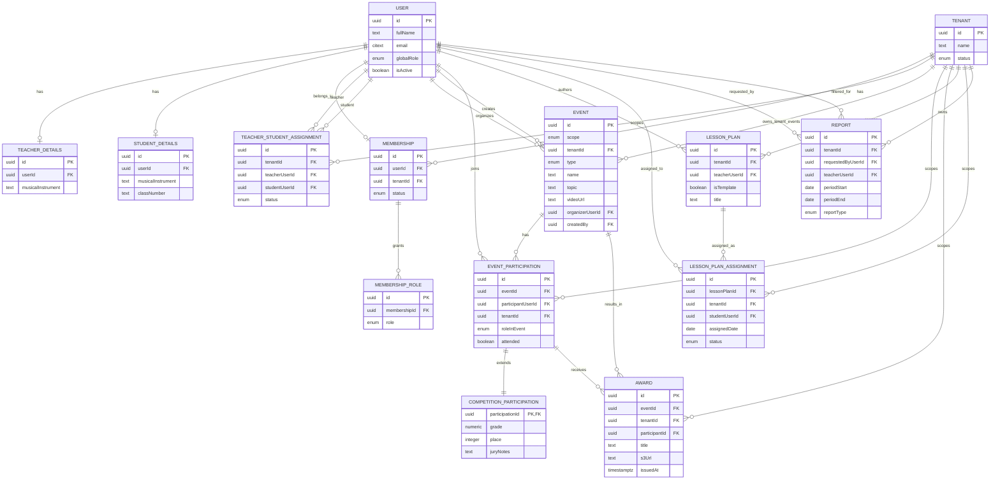
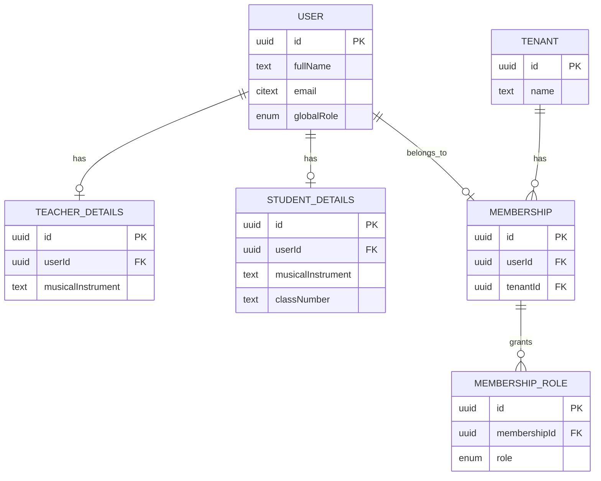
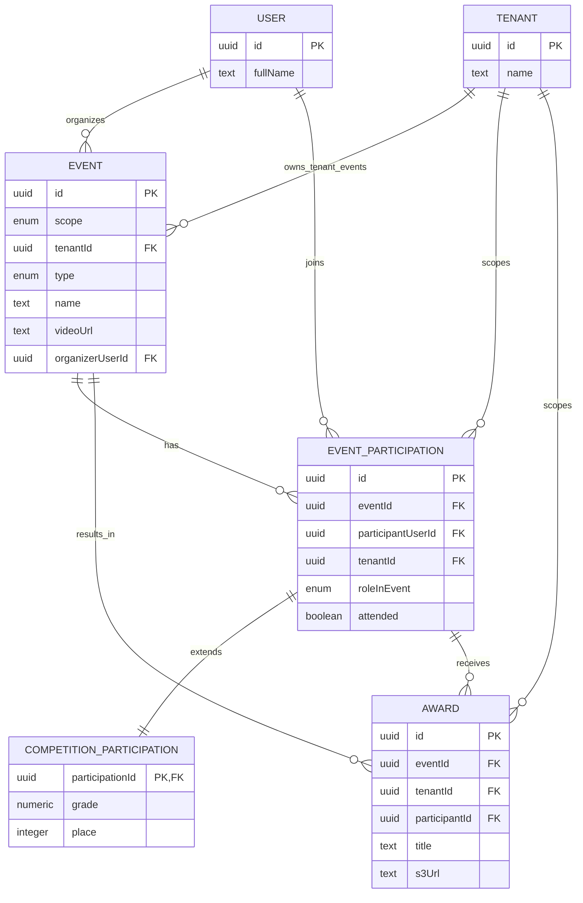
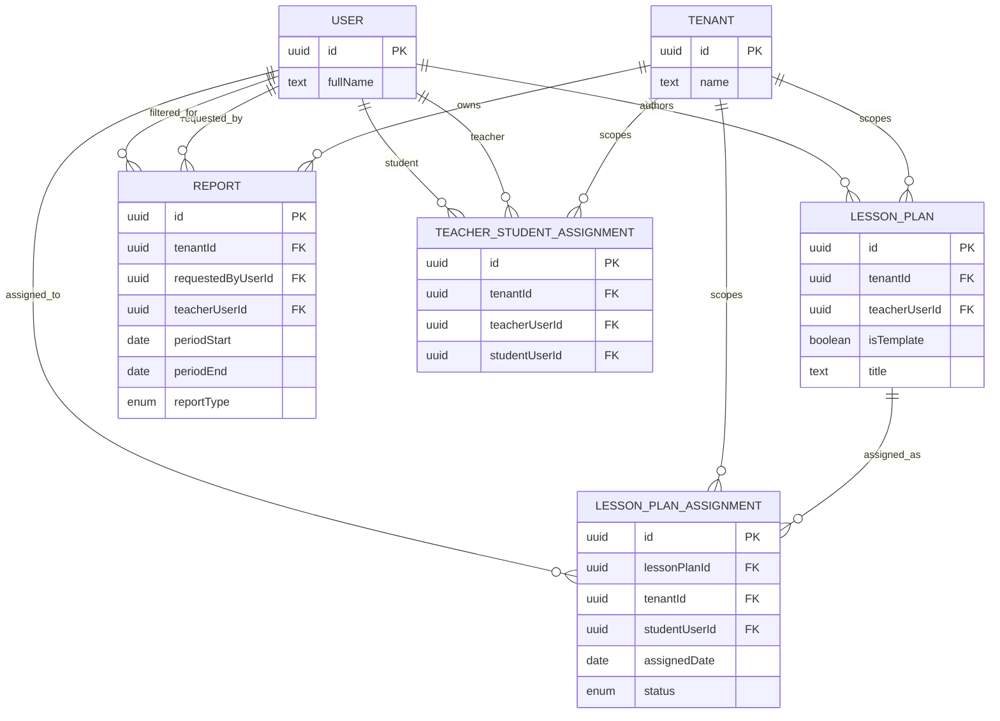

# ERD Diagrams

This document contains Mermaid ER diagrams based on the current data model in `docs/data-model.md`.

## Full Overview

## Identity And Tenancy

## Events And Participation

## Lesson Planning And Reports

