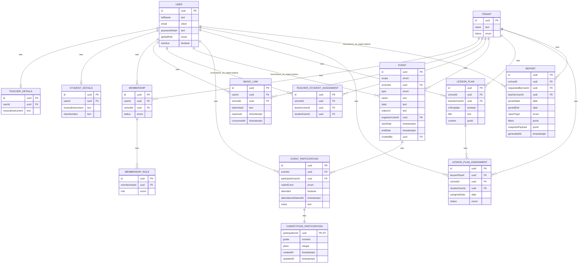
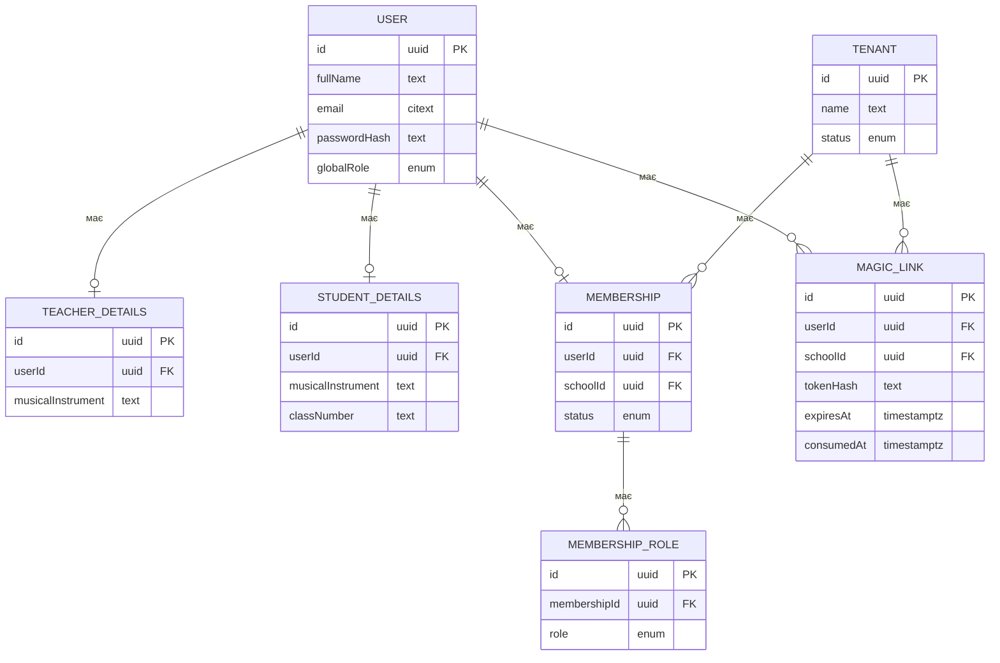
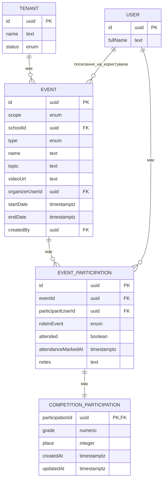
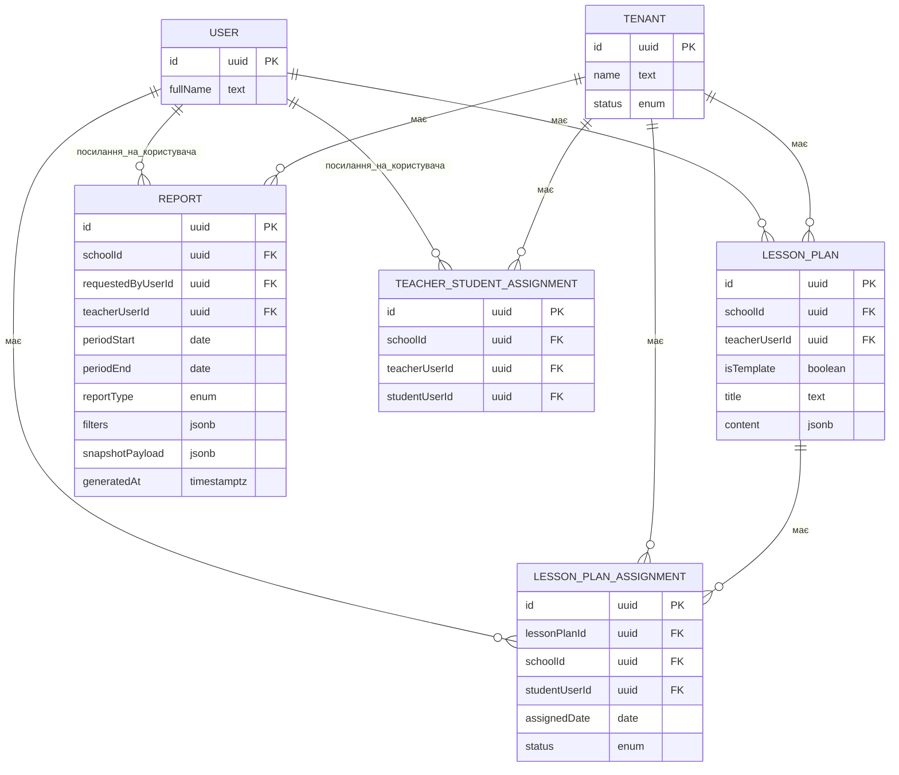

# ERD-діаграми

Цей документ містить Mermaid ER-діаграми, побудовані на основі актуальної моделі даних з `docs/data-model.md`.

## Повний огляд

## Ідентифікація та тенанти

## Події та участь

## Планування уроків та звітність

