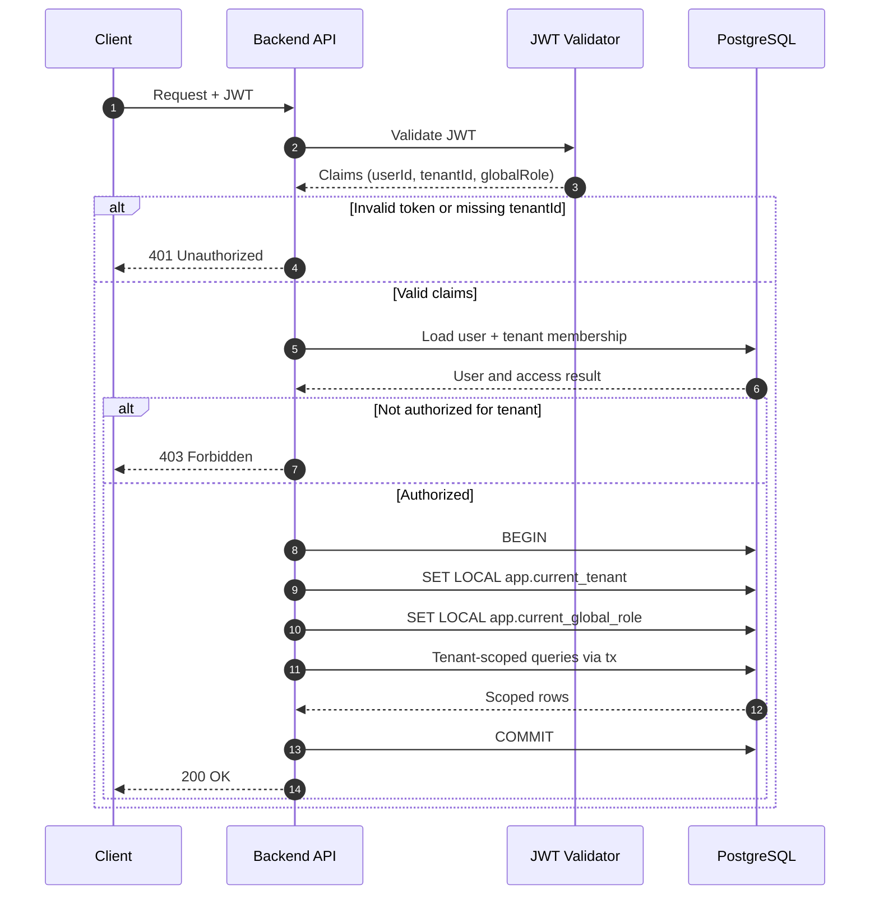

## Context

The platform is multi-tenant and must guarantee that each request is executed in the correct tenant context.

Risks without a strict strategy:

- request handled with missing tenant context
- user authenticated but not authorized for target tenant
- context leakage across pooled DB connections
- accidental cross-tenant reads/writes

## Decision

Adopt JWT-first tenant resolution and transaction-scoped tenant context:

1. Extract and validate JWT.
2. Read `tenantId` and user identifier from token claims.
3. Load user and authorize user access to the resolved tenant.
4. Attach user to request object.
5. Execute tenant-scoped DB logic only via `withTenantContext(...)`.
6. Inside transaction set:
   - `SET LOCAL app.current_tenant = <tenantId>`
   - `SET LOCAL app.current_global_role = <role>`
7. Run all repository calls with the same transaction client.

## Diagram

## Consequences

### Positive

- deterministic request scoping
- lower risk of cross-tenant leakage
- consistent behavior across all modules
- compatible with RLS and app-level guards

### Negative

- all tenant-scoped DB code must use wrapper/transaction client
- request pipeline is stricter and slightly more complex

## Alternatives Considered

1. Resolve tenant only in middleware and query DB without transaction-local context.
   - Rejected: prone to missed propagation and connection pool leakage.
2. Pass `tenantId` manually in every repository query only.
   - Rejected: high human error risk; not sufficient without DB-level enforcement.
