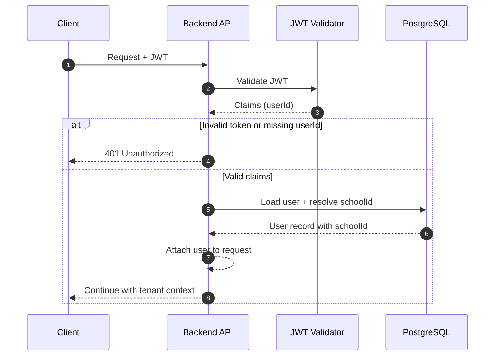

## Контекст

Необхідно визначити безпечний та легкий спосіб, як можна дізнатися до якого тенанта відноситься юзер.

## Рішення

Визначати тенанта через автентифікацію і даних юзера з бази.

1. Витягти та валідувати JWT.
2. Прочитати `userId` з payload токена.
3. Завантажити користувача і визначити тенанта з даних.
4. Прикріпити користувача до об'єкта запиту.
5. Виконувати логіку БД у контексті тенанта лише через `withTenantContext(...)` (див. ADR-002)

## Діаграма

## Наслідки

### Позитивні

- контекст тенанта визначається зі стану БД, що є надійно

### Негативні

- крадіжка токена спричинить витоки даних

## Розглянуті альтернативи

1. Помістити `schoolId` безпосередньо в JWT і використовувати його як авторитетне джерело.
   - Відхилено: переключення/призупинення тенанта стає складніше відображати одразу, і застарілі дані токена можуть розходитися з членством у БД.

2. Передавати `schoolId` з метаданих запиту (`headers` або `req.body`) і довіряти значенню від клієнта.
   - Відхилено: контекст тенанта стає залежним від введення користувача, що збільшує ризик підробки.

3. Передавати `schoolId` у динамічному параметрі.
   - Відхилено: брудна юрл, яка завжди міститиме сегмент із даними, що ми легко отримуємо з бд.
