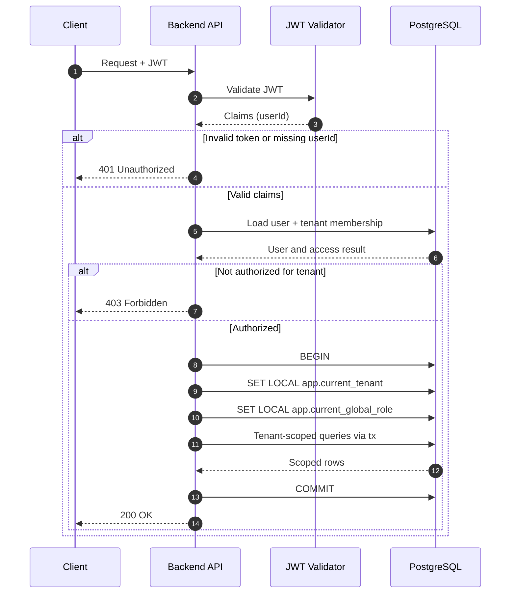

## Контекст

Платформа є мультитенантною і повинна гарантувати, що кожен запит виконується у правильному контексті тенанта щоб попередити витоки даних.

## Рішення

Використовувати JWT-автентифікацію для розпізнавання користувача з серверно-авторитетним контекстом тенанта:

1. Витягти та валідувати JWT.
2. Прочитати `userId` з payload токена.
3. Завантажити користувача та активне членство з БД і визначити тенанта з даних користувача.
4. Прикріпити користувача до об'єкта запиту.
5. Виконувати логіку БД у контексті тенанта лише через `withTenantContext(...)`.
6. Всередині транзакції встановити:
   - `SET LOCAL app.current_tenant = <tenantId>`
   - `SET LOCAL app.current_global_role = <role>`
7. Виконувати всі виклики репозиторію з тим самим клієнтом транзакції.

## Діаграма

## Наслідки

### Позитивні

- контекст тенанта визначається зі стану БД, а не зі застарілих даних токена
- знижений ризик витоку між тенантами
- узгоджена поведінка в усіх модулях, оскільки контекст тенанта визначається у middleware

### Негативні

- ризик крадіжки токена: вкрадений дійсний токен можна відтворити до його закінчення
- складність відкликання: негайний вихід або скасування доступу складніше реалізувати зі stateless токенами
- операційне навантаження: ротація ключів та сувора конфігурація валідації JWT є обов'язковими

## Розглянуті альтернативи

- Помістити `tenantId` безпосередньо в JWT і використовувати його як авторитетне джерело.
  Відхилено: переключення/призупинення тенанта стає складніше відображати одразу, і застарілі дані токена можуть розходитися з членством у БД.

- Передавати `tenantId` з метаданих запиту (`headers` або `req.body`) і довіряти значенню від клієнта.
  Відхилено: контекст тенанта стає залежним від введення користувача, що збільшує ризик підробки.
- Зберігати серверні сесії та визначати тенанта зі стану сесії замість даних JWT.
  Відхилено: додає зберігання stateful сесій та складність їх інвалідації, а також знижує горизонтальну масштабованість порівняно зі stateless JWT-рішенням.
