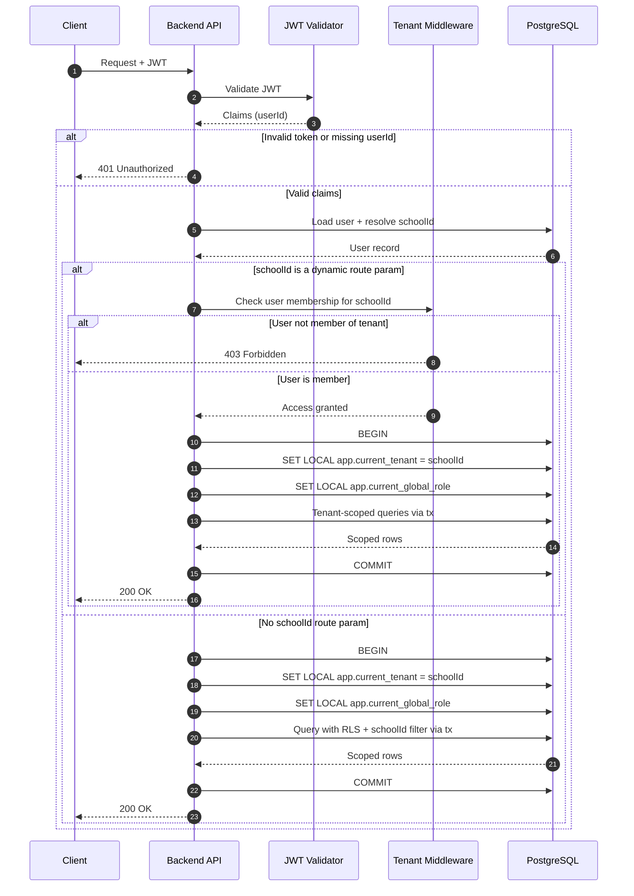

## Контекст

Платформа є мультитенантною і повинна гарантувати, що кожен запит виконується у правильному контексті тенанта щоб попередити витоки даних.

## Рішення

Використовувати JWT-автентифікацію для розпізнавання користувача і його schoolId:

1. Витягти та валідувати JWT.
2. Прочитати `userId` з payload токена.
3. Завантажити користувача і визначити тенанта з даних.
4. Прикріпити користувача до об'єкта запиту.
5. Якщо реквест до ендпоїнта, де динамічним параметром є schoolId, у спеціально призначеній мідлварі зробити перевірку, чи користувач може робити такий реквест. Якщо динамічним параметром не є schoolId, а запит буде на отримання певних даних, то використовуються можливості рлс + фільтрація за schoolId.
6. Виконувати логіку БД у контексті тенанта лише через `withTenantContext(...)`.
7. Всередині транзакції встановити:
   - `SET LOCAL app.current_tenant = <schoolId>`
   - `SET LOCAL app.current_global_role = <role>`

## Діаграма

## Наслідки

### Позитивні

- контекст тенанта визначається зі стану БД, а не зі застарілих даних токена
- знижений ризик витоку даних між тенантами, адже на кожному реквесті поряд з перевіркою токена буде перевірятися, чи може юзер отримати доступ до поточного ендпоїнту

### Негативні

- тільки ті що пов'язані з токеном - крадіжка токена спричинить витоки даних

## Розглянуті альтернативи

- Помістити `schoolId` безпосередньо в JWT і використовувати його як авторитетне джерело.
  Відхилено: переключення/призупинення тенанта стає складніше відображати одразу, і застарілі дані токена можуть розходитися з членством у БД.

- Передавати `schoolId` з метаданих запиту (`headers` або `req.body`) і довіряти значенню від клієнта.
  Відхилено: контекст тенанта стає залежним від введення користувача, що збільшує ризик підробки.

- Передавати `schoolId` у динамічному параметрі.
  Відхилено: брудна юрл, яка завжди міститиме сегмент із даними, що ми легко отримуємо з бд.
