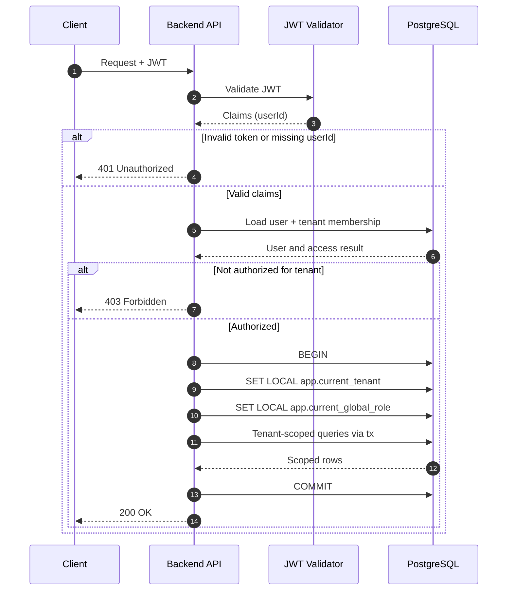

## Context

The platform is multi-tenant and must guarantee that each request is executed in the correct tenant context.

## Decision

Adopt JWT-authenticated user resolution with server-authoritative tenant context:

1. Extract and validate JWT.
2. Read `userId` from token payload.
3. Load user and active membership from DB and resolve tenant from user.
4. Attach user to request object.
5. Execute tenant-scoped DB logic only via `withTenantContext(...)`.
6. Inside transaction set:
   - `SET LOCAL app.current_tenant = <tenantId>`
   - `SET LOCAL app.current_global_role = <role>`
7. Run all repository calls with the same transaction client.

## Diagram

## Consequences

### Positive

- tenant context is resolved from DB state, not stale token claims
- lower risk of cross-tenant leakage
- consistent behavior across all modules as tenant context is derived in middleware

### Negative

- token theft risk: a stolen valid token can be replayed until it expires
- revocation complexity: immediate logout or access removal is harder with stateless tokens
- operational burden: key rotation and strict JWT validation configuration are mandatory

## Alternatives Considered

- Put `tenantId` directly in JWT and use it as authoritative source.
  Rejected: tenant switches/suspensions become harder to reflect immediately and stale token claims can diverge from DB membership.

- Pass `tenantId` from request metadata (`headers` or `req.body`) and trust the client-provided value.
  Rejected: tenant context becomes user-input driven, increases tampering risk.
- Keep server-side sessions and resolve tenant from session state instead of JWT claims.
  Rejected: adds stateful session storage and invalidation complexity, and reduces horizontal scalability compared to stateless JWT-based resolution.
