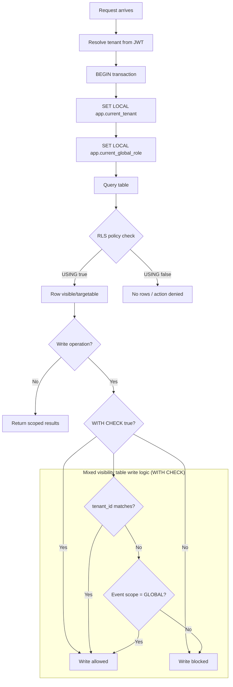

## Title

Use "Share everything" approach with RLS

## Status

Accepted

## Context

The system must isolate tenant-owned data while still supporting cross-tenant collaboration for global events.

## Contraints

- limited budget ($3000)
- limited development time (3 months)

## Decision

Use shared PostgreSQL with Row-Level Security as primary enforcement.

1. Enable RLS on tenant-scoped tables and use `FORCE ROW LEVEL SECURITY`.
2. Set transaction context per request:
   - `app.current_tenant`
   - `app.current_global_role`
3. Use deny-by-default policy shape:
   - `USING` for read/target row visibility
   - `WITH CHECK` for insert/update row validity
4. Add role-aware policy variants where sysadmin cross-tenant read is required.
5. For mixed visibility tables (`event`, `event_participation`, `award`), split SELECT and write policies:
   - **SELECT**: own-tenant rows OR `scope = 'GLOBAL'` rows (+ sysadmin override)
   - **event writes**: restricted to the owning tenant only
   - **participation and award writes**: allow cross-tenant writes when the referenced event has `scope = 'GLOBAL'`, enforced via `EXISTS (SELECT 1 FROM event WHERE scope = 'GLOBAL')` in `WITH CHECK`

## Why?

### 1. Product Requirements Fit

The system requires some **cross-tenant features**: competitions and webinars

A shared database enables simple queries and avoids distributed system complexity.
If we used multiple databases and need to fetch a specific event participants, we would need to list all dbs, conduct fetching queries for each of them, and finally merge results in application level. In out shared db case we fetch all data with a simple request.

### 2. Fast Development

- single schema
- one migration pipeline

### 3. Operational Simplicity

- centralized monitoring
- simpler backups
- easier maintenance
- quick tenant onboarding

### 4. Cost Efficiency

- one database instance
- efficient resource usage
- no idle infrastructure per tenant (if we used multiple dbs, we would need to pay for each even if data is not used and activity is minimal)

## Diagram

## Consequences

### Positive

- database-enforced tenant boundaries
- safer behavior when app-level filters are missing
- supports global event collaboration without disabling isolation

### Negative

- policy management complexity increases
- migration/testing must include policy verification
- developers must always run tenant-scoped DB work in the context wrapper — without it, `current_setting('app.current_tenant', true)` returns `NULL`, so `USING` evaluates to false and reads return 0 rows silently, which might be hard to debug; `WITH CHECK` evaluates to false and writes are rejected with a policy violation error

## Alternatives Considered

1. Schema per tenant.
   - Rejected: migration and operational difficulty, more complex cross-tenant query.
   - Pros: stronger logical isolation than shared tables.
   - Cons: complex migrations, difficult backups, poor ORM support (most ORMs assume a single schema), more complex cross-tenant queries, noisy neighbor problem still present at DB level.

2. Database per tenant.
   - Rejected: the same as "schema per tenant" but also much more difficult and not enough users for a single db instance (each school having 50 - 300 users, which is not enough to start a new db each time)
   - Pros: maximum isolation, no noisy neighbor, popular with enterprise SaaS.
   - Cons: high infrastructure complexity, very expensive (idle DB cost per tenant even at low activity), cross-tenant collaboration requires distributed queries or data duplication.

3. Application-only tenant filtering (no RLS).
   - Rejected: insufficient safety against accidental leaks (developers skip where and data leakage occurs)
   - Cons: one missed `where tenantId = ...` clause leaks data silently; no database-level backstop.

4. Hybrid - decision based on the tier.
   - Rejected: there is no plan for tiers, all schools are supposed to be equal. However, we might migrate to this partially if some tenants are very big, which is unlikely in the near future.
