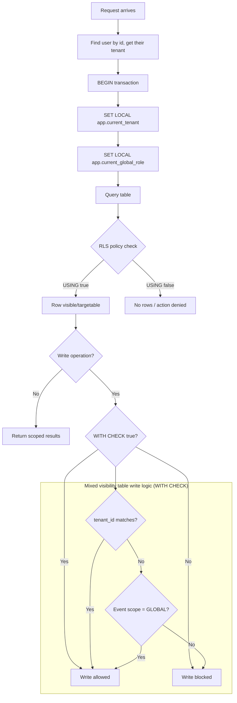

## Контекст

Система повинна ізолювати дані, що належать тенантам, а саме:

1. Report читання та запис.
2. LessonPlan читання та запис.
3. MagicLink читання та запис.
4. LessonPlanAssignment читання та запис.
5. User читання та запис.
6. Event + EventParticipation (якщо isGlobal = false) читання та запис.

Система дозволяє глобальний доступ до:

1. TeacherProfile читання.
2. StudentProfile читання.
3. Event + EventParticipation (якщо isGlobal = true) читання, реєстрацію та оновлення.

## Рішення

Використовувати спільну PostgreSQL з Row-Level Security як основним механізмом захисту.
Кожен рядок таблиці міститиме schoolId і буде доступним лише представникам даного школи-тенанта.

1. Увімкнути RLS на таблицях рівня тенанта та використовувати `FORCE ROW LEVEL SECURITY`
2. Встановлювати контекст транзакції для кожного запиту:
   - `app.current_tenant`
   - `app.current_global_role`
3. Використовувати політику "заборонено за замовчуванням":
   - `USING` — для видимості рядків при читанні
   - `WITH CHECK` — для перевірки рядків при оновленні
4. Додати варіанти політик з урахуванням ролей там, де потрібне міжтенантне читання для sysadmin.
5. Для таблиць із глобальною видимістю на основі поля isGlobal = true продумати динамічну політику

## Чому?

### 1. Відповідність продуктовим вимогам

Система вимагає певних **міжтенантних функцій**

Якщо б ми використовували кілька баз даних і потрібно отримати учасників певної події, ми мали б перебирати всі БД, виконувати запити для кожної з них, об'єднувати результати на рівні застосунку. У нашому випадку зі спільною БД ми отримуємо всі дані одним запитом.

### 2. Швидка розробка

- єдина схема
- одна бд
- один пайплайн міграцій

### 3. Простота використання

- централізований моніторинг
- простіші бекапи
- легше обслуговування
- швидке підключення нових тенантів

### 4. Економічна ефективність

- відсутність необхідності платити за бд, якщо вона неактивна

## Діаграма

## Наслідки

### Позитивні

- межі між тенантами забезпечені на рівні БД
- підтримує міжтенантну співпрацю для глобальних подій без вимкнення ізоляції для критичних даних

### Негативні

- зростає складність управління політиками, відсутня експертиза в їх використанні, що сповільнить розробку на перших етапах
- розробники завжди повинні виконувати роботу з БД у контексті тенанта через обгортку, що дадаватиметься до кожного запиту `current_setting('app.current_tenant', true)`, що може створити незручності

## Розглянуті альтернативи

1. Окрема схема на тенанта.
   - Відхилено: складність міграцій, більш складні міжтенантні запити.
   - Плюси: сильніша логічна ізоляція, ніж у спільних таблицях.
   - Мінуси: складні міграції, проблемні бекапи, погана підтримка ORM (більшість ORM припускають єдину схему), складніші міжтенантні запити, проблема «галасливого сусіда» все одно присутня на рівні БД.

2. Окрема база даних на тенанта.
   - Відхилено: ті самі проблеми, що і з "окремою схемою", але ще складніше, і замало користувачів для окремого екземпляра БД (кожна школа має 50–300 користувачів, чого недостатньо для запуску нової БД щоразу)
   - Плюси: максимальна ізоляція, відсутність «галасливого сусіда».
   - Мінуси: дуже дорого, міжтенантна співпраця вимагає розподілених запитів.

3. Фільтрація тенантів лише на рівні застосунку (без RLS).
   - Відхилено: недостатній захист від випадкових витоків (розробники пропускають where і відбувається витік даних)
   - Мінуси: один пропущений `where tenantId = ...` призводить до тихого витоку даних; відсутній захист на рівні БД.

4. Гібридний підхід — рішення залежно від тарифу.
   - Відхилено: немає планів щодо тарифів, всі школи мають бути рівними. Проте, ми можемо частково мігрувати до цього підходу, якщо деякі тенанти стануть дуже великими, що малоймовірно найближчим часом.
