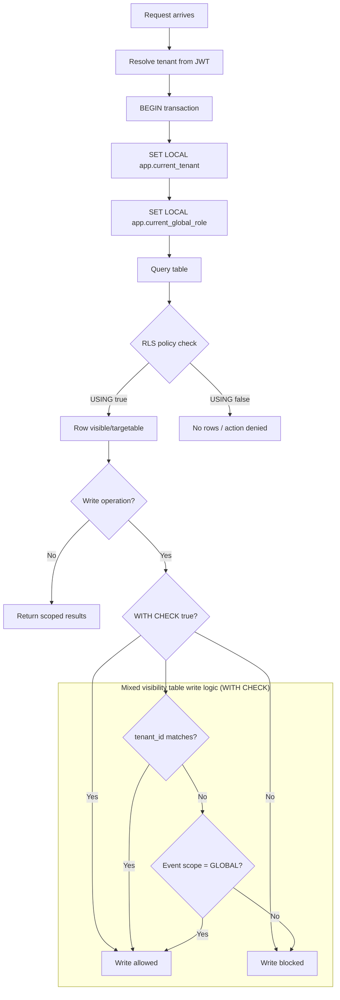

<!-- 📄 What an ADR usually contains

Decision
What you chose
Consequences
Pros, cons, and what this decision impacts
 -->

<!-- 🧩 Example (super simplified)

Decision: Use REST instead of GraphQL
Why: Team already knows REST, faster to ship
Trade-off: Less flexibility for frontend later -->

## Title

Use "Share everything" approach

## Status

Accepted

## Context

The system must isolate tenant-owned data while still supporting cross-tenant collaboration for global events.

## Contraints

- limited budget ($3000)
- limited development time (3 months)

## Decision

Use shared PostgreSQL with Row-Level Security as primary enforcement.

1. Enable RLS on tenant-scoped tables and use `FORCE ROW LEVEL SECURITY`.
2. Set transaction context per request:
   - `app.current_tenant`
   - `app.current_global_role`
3. Use deny-by-default policy shape:
   - `USING` for read/target row visibility
   - `WITH CHECK` for insert/update row validity
4. Add role-aware policy variants where sysadmin cross-tenant read is required.
5. For mixed visibility tables (`event`, `event_participation`, `award`), split SELECT and write policies:
   - **SELECT**: own-tenant rows OR `scope = 'GLOBAL'` rows (+ sysadmin override)
   - **event writes**: restricted to the owning tenant only
   - **participation and award writes**: allow cross-tenant writes when the referenced event has `scope = 'GLOBAL'`, enforced via `EXISTS (SELECT 1 FROM event WHERE scope = 'GLOBAL')` in `WITH CHECK`

## Diagram

## Consequences

### Positive

- database-enforced tenant boundaries
- safer behavior when app-level filters are missing
- explicit, auditable access rules per table type
- supports global event collaboration without disabling isolation

### Negative

- policy management complexity increases
- migration/testing must include policy verification
- developers must always run tenant-scoped DB work in context wrapper

## Alternatives Considered

1. Schema per tenant.
   - Rejected: migration and operational overhead, weaker cross-tenant query ergonomics.
2. Database per tenant.
   - Rejected: high operational cost and complexity for collaboration features.
3. Application-only tenant filtering (no RLS).
   - Rejected: insufficient safety against accidental leaks.
4. Hybrid - decision based on the tier.
   - Rejected: there is no plan for tiers, all schools are equal.
