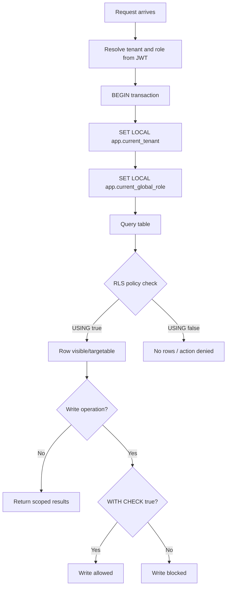

## Context

The system must isolate tenant-owned data while still supporting cross-tenant collaboration for global events.

Requirements:

- prevent accidental leaks when developers miss tenant filters
- deny-by-default tenant data access
- allow controlled sysadmin cross-tenant read access
- support mixed-visibility tables (`TENANT` + `GLOBAL` rows)

## Decision

Use shared PostgreSQL with Row-Level Security as primary enforcement.

1. Enable RLS on tenant-scoped tables and use `FORCE ROW LEVEL SECURITY`.
2. Set transaction context per request:
   - `app.current_tenant`
   - `app.current_global_role`
3. Use deny-by-default policy shape:
   - `USING` for read/target row visibility
   - `WITH CHECK` for insert/update row validity
4. Add role-aware policy variants where sysadmin cross-tenant read is required.
5. For mixed visibility tables (`event`, related writes), allow:
   - read global rows by authenticated tenant users
   - tenant row access only for matching tenant
   - privileged global writes only by sysadmin

## Diagram

## Consequences

### Positive

- database-enforced tenant boundaries
- safer behavior when app-level filters are missing
- explicit, auditable access rules per table type
- supports global event collaboration without disabling isolation

### Negative

- policy management complexity increases
- migration/testing must include policy verification
- developers must always run tenant-scoped DB work in context wrapper

## Alternatives Considered

1. Schema per tenant.
   - Rejected: migration and operational overhead, weaker cross-tenant query ergonomics.
2. Database per tenant.
   - Rejected: high operational cost and complexity for collaboration features.
3. Application-only tenant filtering (no RLS).
   - Rejected: insufficient safety against accidental leaks.
4. Hybrid - decision based on the tier.
   - Rejected: there is no plan for tiers, all schools are equal.
