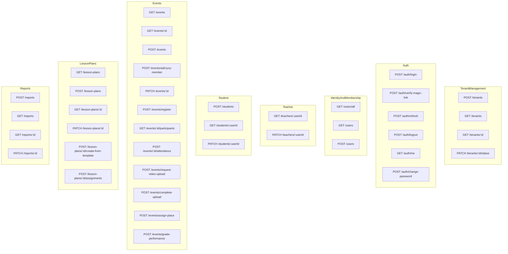
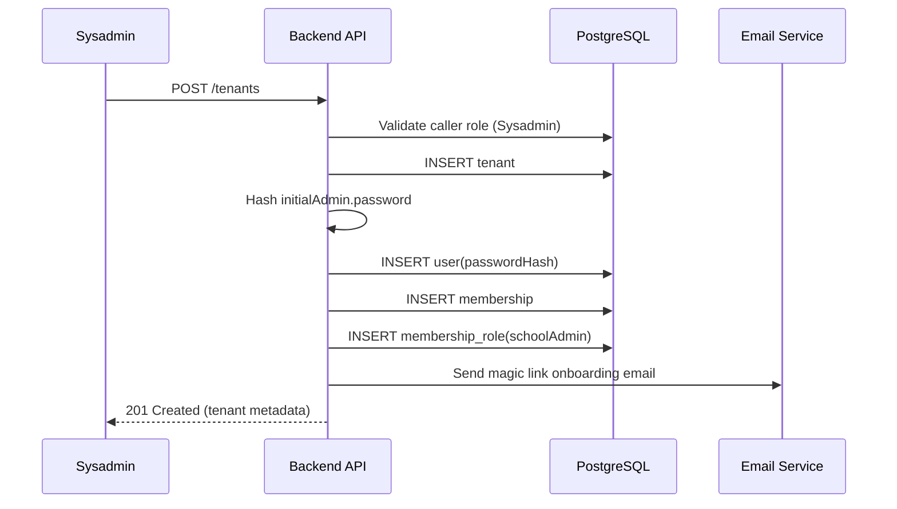
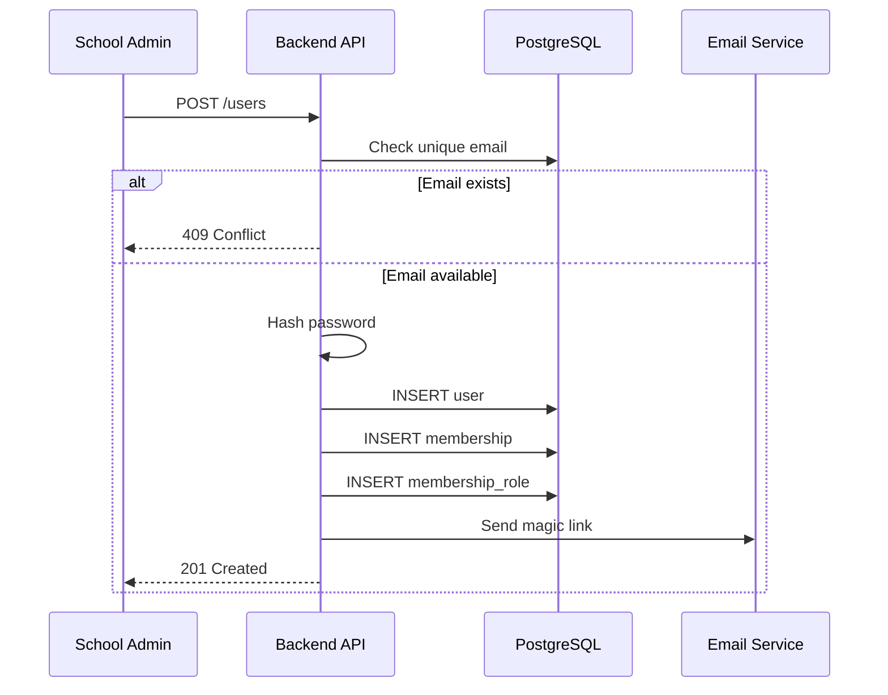
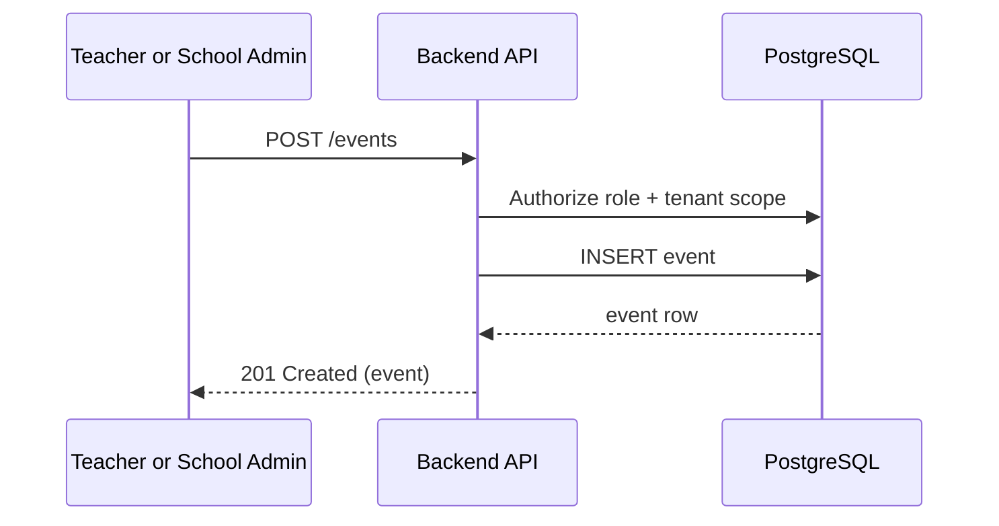
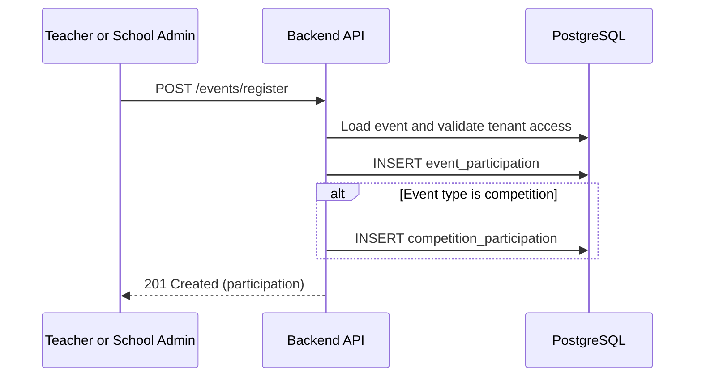
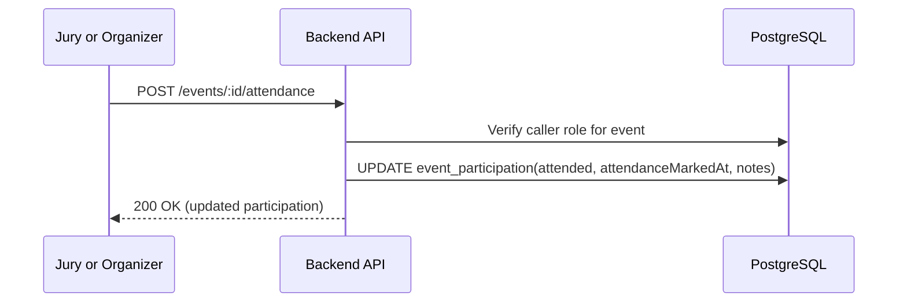
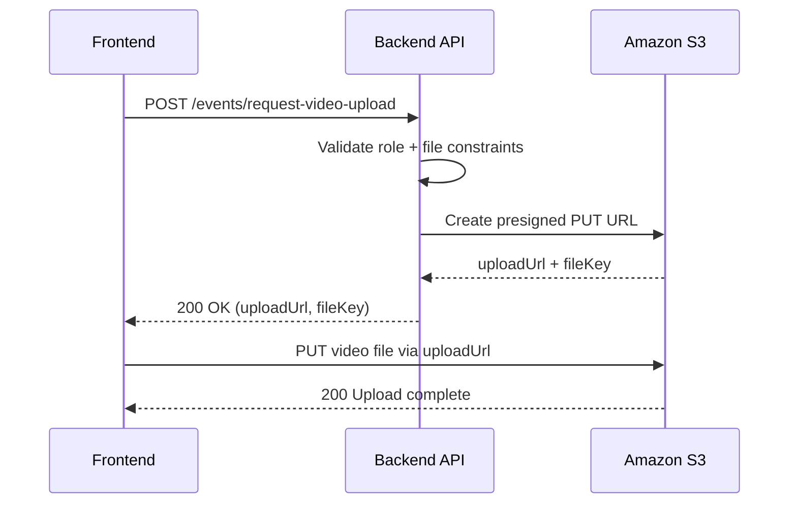
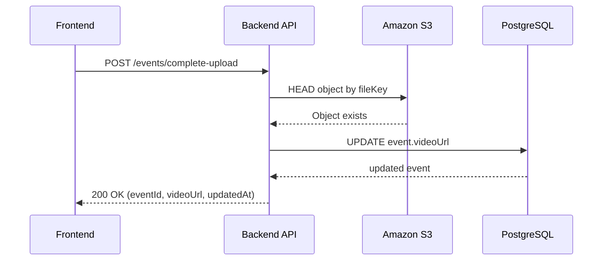
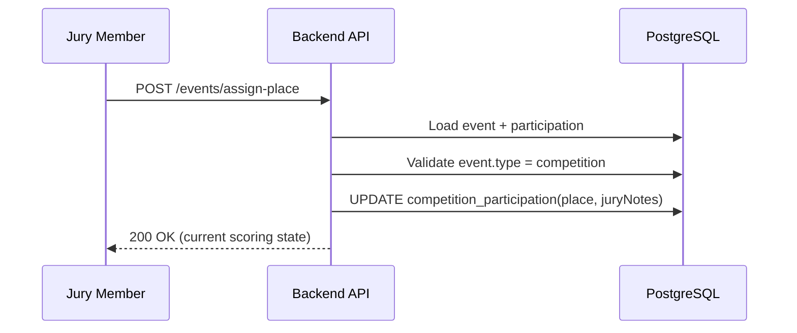

## All endpoints listing

### Tenant Management

- `POST /tenants` - sysadmin creates a tenant + school admin in one go (fills in their intial name and password)
- `GET /tenants`
- `GET /tenants/:id`
- `PATCH /tenants/:id/status`

### Auth

- `POST /auth/login` - password validation + request magic link
- `POST /auth/verify-magic-link` - real login
- `POST /auth/refresh`
- `POST /auth/logout`
- `GET /auth/me`
- `POST /auth/change-password`

### Identity and Membership

- `GET /users/all` - sysadmin sees all with filters
- `GET /users/` - endpoint for school admins, they only see users of their tenant
- `POST /users` - school admin creates a user (teacher or student), memebership and memebershipRole in one go

### Teacher

- `GET /teachers/:userId` - teacher or schooladmin can fetch this data
- `PATCH /teachers/:userId` - teacher or shooladmin can edit

#### Student

- `POST /students` - teacher creates a student and they're automatically linked in teacher_student_assignment
- `GET /students/:userId` - teacher or schooladmin can fetch
- `PATCH /students/:userId` - teacher or shooladmin can edit

### Events

- `GET /events` - school admin sees events of their tenant + global ones
- `GET /events/:id`
- `POST /events` - create an event
- `POST /events/add-jury-member` - a new jury memeber membership_role row is created, a row in event_jury is created
- `PATCH /events/:id` - update an event (organizer only)
- `POST /events/register` - participation is created here
- `GET /events/:id/participants`
- `POST /events/:id/attendance` - mark attendance (called for webinars)
- `POST /events/request-video-upload`
- `POST /events/complete-video-upload`
- `POST /events/assign-place` - for competitions
- `POST /events/grade-performance` - for competitions

### Lesson Plans

- `GET /lesson-plans`
- `POST /lesson-plans`
- `GET /lesson-plans/:id`
- `PATCH /lesson-plans/:id`
- `POST /lesson-plans/:id/create-from-template`
- `POST /lesson-plans/:id/assignments` - links a lesson plan to a student

### Reports

- `POST /reports`
- `GET /reports`
- `GET /reports/:id`
- `PATCH /reports/:id`

## Global Endpoint Schema



## 8 ENDPOINTS BREAKDOWNS

## TENANT MANAGEMENT

Access rules:

- Required auth: yes
- Allowed roles: `globalRole = Sysadmin`

### 1. POST /tenants

Creates a new tenant (school).

Request body:

```json
{
  "name": "Kyiv Music School #7",
  "initialAdmin": {
    "fullName": "Olena Bondarenko",
    "email": "admin@school7.edu.ua",
    "password": "StrongPass!123"
  }
}
```

Response `201`:

```json
{
  "id": "9c926e8a-2e4e-4490-98a0-725d32ba1628",
  "name": "Kyiv Music School #7",
  "status": "active",
  "createdAt": "2026-04-14T08:10:00Z"
}
```

Internal flow:

1. `TenantManagementModule.SchoolService` validates caller is Sysadmin.
2. Create row in `tenant` (`status=active`).
3. Hash `initialAdmin.password` using strong password hashing algorithm (`argon2id` or `bcrypt`).
4. Create `user` row from `initialAdmin.fullName` + `initialAdmin.email`, storing `passwordHash`.
5. Create `membership` row linking new admin user to the new tenant.
6. Create `membership_role` with `schoolAdmin`.
7. Trigger magic-link onboarding email for `initialAdmin.email` (non-blocking side effect).
8. Return data.
9. User clicks magic link in the email and gets redirected to their page.
10. They can change their password right now.

Sequence diagram:



## IDENTITY AND MEMBERSHIP

### 2. POST /users

Creates a platform user identity (teacher or student).

Auth and roles:

- Required auth: yes
- Allowed roles: `schoolAdmin`

Request body:

```json
{
  "fullName": "Maksym Kovalenko",
  "email": "maksym.kovalenko@school-a.edu.ua",
  "globalRole": "Member",
  "membershipRole": "Teacher",
  "password": "Secret2000"
}
```

Response `201`:

```json
{
  "id": "f8f2aef3-8c1d-453f-ab2a-fda1faa8e072",
  "fullName": "Maksym Kovalenko",
  "email": "maksym.kovalenko@school-a.edu.ua",
  "globalRole": "Member",
  "membershipRole": "Teacher",
  "isActive": "true"
}
```

Internal flow:

1. Validate uniqueness by email: if email exists, return "Conflict".
2. Save password hash.
3. Create user + membership + membership role.
4. Send magic link to a new user.
5. Return created identity.
6. The new user clicks the magic link. They can now see their profile and can change their password.

Sequence diagram:



## EVENTS

### 3. POST /events

Creates an event (`webinar`, `concert`, `competition`).

Auth and roles:

- Required auth: yes
- Allowed roles: `schoolAdmin`, `teacher`

Request body:

```json
{
  "scope": "TENANT",
  "type": "webinar",
  "name": "Methodology Webinar",
  "topic": "Choir rehearsal techniques",
  "startDate": "2026-04-20T15:00:00Z",
  "endDate": "2026-04-20T16:30:00Z",
  "organizerUserId": "9bdf0506-cb0f-4f54-860e-a6eb4f742fc2"
}
```

Response `201`:

```json
{
  "id": "11c96f9b-0d8d-45f2-a26d-5f8e14666ec2",
  "scope": "TENANT",
  "tenantId": "9c926e8a-2e4e-4490-98a0-725d32ba1628",
  "type": "webinar",
  "name": "Methodology Webinar",
  "topic": "Choir rehearsal techniques",
  "videoUrl": null,
  "organizerUserId": "9bdf0506-cb0f-4f54-860e-a6eb4f742fc2",
  "startDate": "2026-04-20T15:00:00Z",
  "endDate": "2026-04-20T16:30:00Z"
}
```

Internal flow:

1. Insert row into `event` with organizer IDs and other input data.
2. Return created event.

Sequence diagram:



### 4. POST /events/register

Registers participant in event.

Auth and roles:

- Required auth: yes
- Allowed roles: `schoolAdmin`, `teacher`

Request body:

```json
{
  "eventId": "4f2d6ce7-8d42-4d7e-8f4a-4e953d3f66b5",
  "participantUserId": "7777d9fb-8c37-4b12-b0b3-09f66dc34f7f",
  "roleInEvent": "performer",
  "notes": "solo piano"
}
```

Response `201`:

```json
{
  "id": "b76607e7-e5b1-49bc-8130-836b3d5d1ed7",
  "eventId": "4f2d6ce7-8d42-4d7e-8f4a-4e953d3f66b5",
  "participantUserId": "7777d9fb-8c37-4b12-b0b3-09f66dc34f7f",
  "tenantId": "9c926e8a-2e4e-4490-98a0-725d32ba1628",
  "roleInEvent": "performer",
  "attended": false,
  "notes": "solo piano"
}
```

Internal flow:

1. Compare user.id === event.tenantId if event is tenant-scoped. Otherwise, proceed without this check.
2. Insert into `event_participation`.
3. If competition, insert into `competition_participation` with null grade/place.
4. Return participation data.

Sequence diagram:



### 5. POST /events/:id/attendance

Marks participant attendance (called for webinars directly, for competitions and cocerts participation is marked when videos uploaded).

Auth and roles:

- Required auth: yes
- Allowed roles: `jury` or `organizer`

Request body:

```json
{
  "participantUserId": "7777d9fb-8c37-4b12-b0b3-09f66dc34f7f",
  "attended": true,
  "notes": "arrived on time"
}
```

Internal flow:

1. Authorize user (check the role)
2. Update `attended`, `attendanceMarkedAt`, `notes`.
3. Return updated participation.

Sequence diagram:



### 6. POST /events/request-video-upload

Step 1: request a one-time presigned upload URL for event video.

Auth and roles:

- Required auth: yes
- Allowed roles: teacher (needs to be an organizer)

Request body:

```json
{
  "eventId": "11c96f9b-0d8d-45f2-a26d-5f8e14666ec2",
  "fileName": "webinar-2026-04-20.mp4",
  "contentType": "video/mp4",
  "fileSizeBytes": 523001002,
  "participantId": "dkejn46218ttt"
}
```

Response `200`:

```json
{
  "eventId": "11c96f9b-0d8d-45f2-a26d-5f8e14666ec2",
  "uploadUrl": "https://s3.eu-west-1.amazonaws.com/...signed...",
  "fileKey": "events/11c96f9b-0d8d-45f2-a26d-5f8e14666ec2/webinar-2026-04-20.mp4",
  "expiresInSeconds": 900
}
```

Internal flow:

1. Authenticate and authorize user for the specific event
2. Validate file constraints (type, size)
3. Retrieve event metadata (e.g., type)
4. Generate a structured fileKey based on key info (event type, participantId, organizerId etc,)
5. Backend creates a presigned PUT URL for Amazon S3
6. Return uploadUrl and fileKey to client
7. Client uploads file directly to S3

Sequence diagram:



### 7. POST /events/complete-upload

Step 2: confirm upload and persist event video reference.

Auth and roles:

- Required auth: yes
- Allowed roles: `schoolAdmin` or `teacher`

Request body:

```json
{
  "eventId": "11c96f9b-0d8d-45f2-a26d-5f8e14666ec2",
  "fileKey": "events/11c96f9b-0d8d-45f2-a26d-5f8e14666ec2/webinar-2026-04-20.mp4",
  "videoUrl": "https://cdn.example.com/events/11c96f9b-0d8d-45f2-a26d-5f8e14666ec2/webinar-2026-04-20.mp4"
}
```

Response `200`:

```json
{
  "eventId": "11c96f9b-0d8d-45f2-a26d-5f8e14666ec2",
  "videoUrl": "https://cdn.example.com/events/11c96f9b-0d8d-45f2-a26d-5f8e14666ec2/webinar-2026-04-20.mp4",
  "updatedAt": "2026-04-20T17:00:00Z"
}
```

Internal flow:

1. Frontend uploads file directly to S3 using presigned `uploadUrl` from step 1.
2. Frontend calls this endpoint to confirm upload completion.
3. Backend verifies object existence and ownership.
4. Update `event.videoUrl`.
5. Return updated event video metadata.

Sequence diagram:



### 8. POST /events/assign-place

Assigns place to participant.

Auth and roles:

- Required auth: yes
- Allowed roles: `jury`

Request body:

```json
{
  "eventId": "4f2d6ce7-8d42-4d7e-8f4a-4e953d3f66b5",
  "participantUserId": "7777d9fb-8c37-4b12-b0b3-09f66dc34f7f",
  "place": 1,
  "juryNotes": "Excellent interpretation and technique"
}
```

Response `200`:

```json
{
  "participationId": "b76607e7-e5b1-49bc-8130-836b3d5d1ed7",
  "grade": 96.5,
  "place": 1,
  "juryNotes": "Excellent interpretation and technique"
}
```

Internal flow:

1. Find event + participation by `(eventId, participantUserId)`.
2. Check if event type is competition.
3. Update `competition_participation.place` and `juryNotes`.
4. Return current scoring state.

Sequence diagram:


