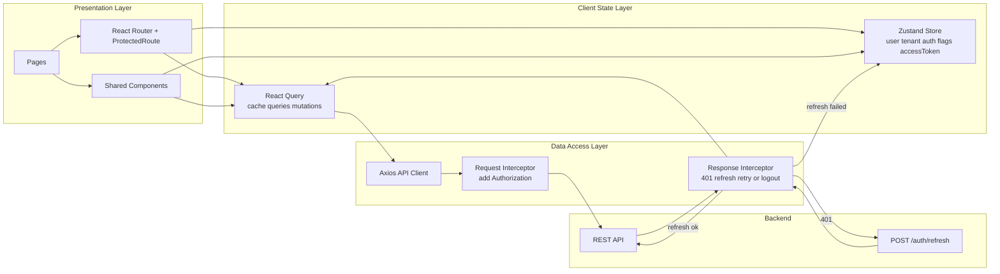

<!-- DOCS_NAV_START -->
[Docs Home](README.md) | [API Design](api-design.md) | [Auth](auth.md) | [RBAC](rbac.md) | [Data Model](data-model.md) | [Security](security.md) | [Deployment](deployment.md) | [Containers](containers.md) | [Context](context.md) | [Frontend](front.md) | [NFR](nfr.md) | [Req-Res Propagation](req-res-propagation.md) | [Risks](risks.md)
<!-- DOCS_NAV_END -->

## Tenant Resolution + Tenant-Scoped API Calls

1. Отримали юзер на фронті.
2. При кожному реквесті беремо тенант айді із стейту де зберігається юзер і передаємо його як динамічний параметр, де він треба

## Post-Login Redirect by Role

| Role           | Redirect after login |
| -------------- | -------------------- |
| `SYSADMIN`     | `/admin/tenants`     |
| `SCHOOL_ADMIN` | `/school/dashboard`  |
| `TEACHER`      | `/home`              |

## Route Protection

Додасться компонент Protected Route. Прийматиме юзер ролі для рауту як пропси і сам компонент

1. Юзер автентифікований? (чи є `access_token`)  
   → Якщо ні, то редірект `/login`
2. Чи юзер має ролі що допускаються для поточного рауту?  
   → Якщо ні, то redirect на `/home`

## Navigation Menu

### SYSADMIN

- Tenants (→ `/admin/tenants`)
- All Users (→ `/admin/users`)
- My Profile (→ `/profile/me`)

### SCHOOL_ADMIN

- Dashboard (→ `/school/dashboard`)
- Users (→ `/school/users`)
- Events (→ `/events`)
- Reports (→ `/reports`)
- My Tenant (→ `/admin/tenants/:id`)
- My Profile (→ `/profile/me`)

### TEACHER

- Events (→ `/events`)
- Students (→ `/students`)
- Lesson Plans (→ `/lesson-plans`)
- Reports (→ `/reports`)
- My Profile (→ `/profile/me` / `/teachers/:userId`)

## Tenant-Aware Scoping

## Access Token Lifecycle

1. При переході лінкою у імейлі запит на верифікацію до бека, який дає токен.
2. Токен зберігаємо in-memory, не в локал сторідж щоб не можна було вкрасти.
3. При кожному запиті токен додається і валідуєтья на беці.
4. Якщо помилка 401 від бека у interceptor зробити рефреш `POST /auth/refresh`.
5. Якщо рефреш фейлиться, редіректити до сторінки логіну `/login`.
6. Якщо юзер вилогінюється, треба почистити токен після запиту логіну і редірект на `/login`.

## State management

Використовуватимемо Zustand, адже він

- швидко імплементовується
- забезпечує зручність маніпуляції глобальними даними

Зберігатиму там:

- інфу по юзеру
- інфу по поточному змаганню, де людина бере участь або організовує наразі
- токени сесії in-memory (`accessToken`)
- системна інфа типу: `isAuthenticated`
- інше

## Api integration pattern

Використовуватимемо React Query для керування асинхронними станами, кешування і background refetch.

Практично це дає нам:

- автоматичні стани `isLoading` / `isError` / `isSuccess` без ручного менеджменту в компонентах
- кешування відповідей на рівні query key (з урахуванням `schoolId`, щоб не змішувати дані між тенантами)
- повторний фетч у фоні при поверненні на вкладку або інвалідації кешу
- централізоване оновлення даних після мутацій через `invalidateQueries`
- контроль `staleTime` / `cacheTime` для балансу між актуальністю і кількістю запитів

Axios використовуватимемо як HTTP-клієнт із централізованими interceptors.

### Що робить request interceptor

- додає Authorization header з accessToken для всіх захищених запитів

### Що робить response interceptor

- перехоплює помилку
- один раз запускає refresh через POST /auth/refresh
- якщо refresh успішний: оновлює accessToken in-memory і повторює початковий запит
- якщо refresh неуспішний: очищає auth state і робить redirect на /login
- для 403, 404, 500 повертає нормалізовану помилку для UI

### Flow обробки відповіді

1. Компонент викликає API через React Query.
2. Axios request interceptor додає токен; tenant context для авторизації визначається бекендом.
3. Бекенд повертає відповідь.
4. Якщо відповідь 2xx: дані потрапляють у кеш React Query.
5. Якщо відповідь 401: response interceptor викликає refresh.
6. Якщо refresh успішний: початковий запит автоматично повторюється.
7. Якщо refresh неуспішний: logout, очищення in-memory токена, redirect на /login.

## Frontend Architecture (Mermaid)

