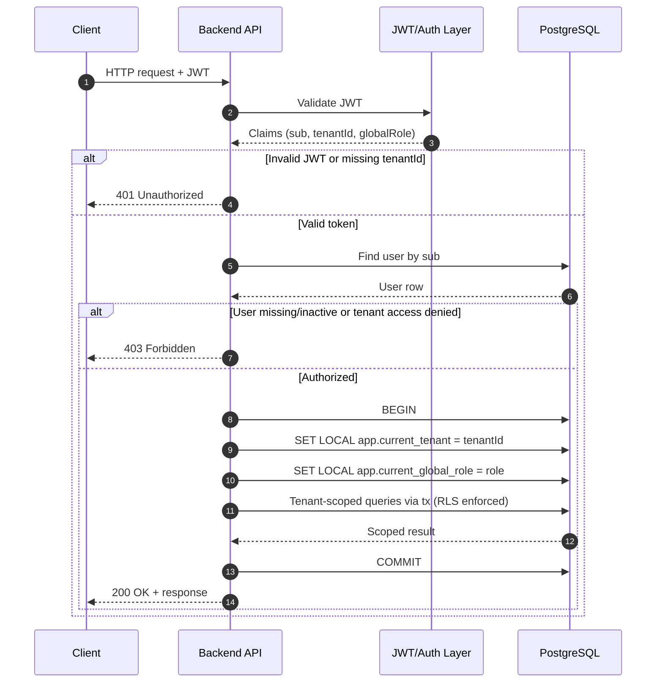

# Tenant Resolution Strategy

## Goal

Resolve tenant and user identity at request start, then run all tenant-scoped database operations inside one transaction context.

## Request Flow

1. Request arrives.
2. Extract JWT from request.
3. Validate JWT signature and expiration.
4. Read `tenantId` and `userId` from validated JWT payload.
5. Load user by id and attach user to request (`req.user`).
6. Check if the user actually belongs to the tenant by comparing user.tenantId === tenantId.
7. For every DB operation, call `withTenantContext(tenantId, ...)`.
8. Inside that transaction, set tenant session context with `SET LOCAL`.
9. Run queries through the transaction client so RLS scopes data to the correct tenant.

## Sequence Diagram

## Summary

This strategy is correct for multi-tenant RLS architecture and is safe if every tenant-scoped DB call is executed through `withTenantContext`.
