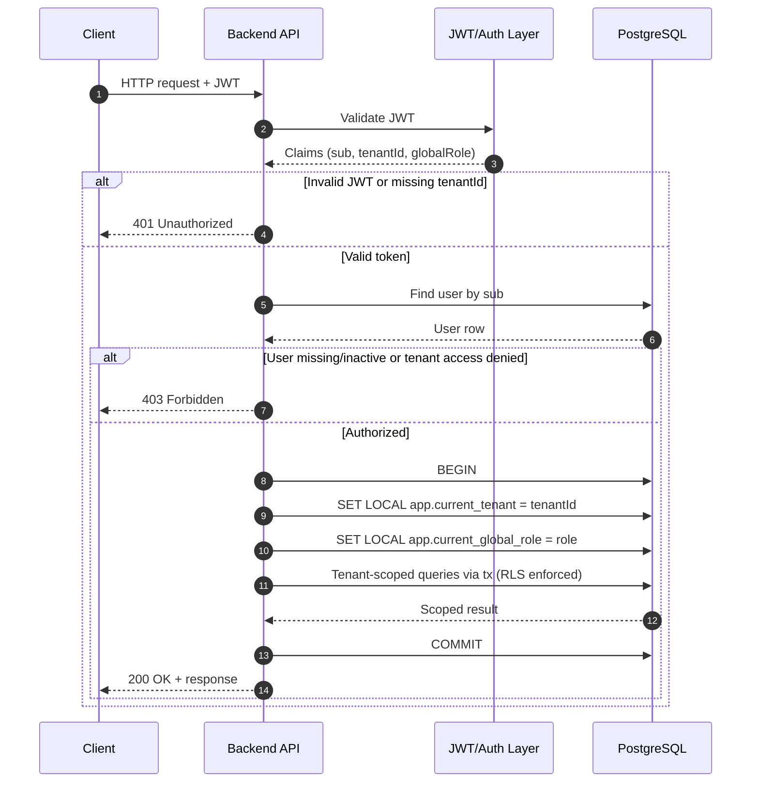

# Tenant Resolution Strategy

## Goal

Resolve tenant and user identity at request start, then run all tenant-scoped database operations inside one transaction context.

## Request Flow

1. Request arrives.
2. Extract JWT from request.
3. Validate JWT signature, expiration, and claims.
4. Read `tenantId` from validated JWT.
5. Load user by token subject (`sub`) and attach user to request (`req.user`).
6. Authorize user access to the resolved tenant.
7. For every DB operation, call `withTenantContext(tenantId, ...)`.
8. Inside that transaction, set tenant session context with `SET LOCAL`.
9. Run queries through the transaction client so RLS scopes data to the correct tenant.

## Why This Works

- Tenant is resolved before business logic executes.
- User identity is bound to the request once and reused.
- `withTenantContext` prevents context leakage across pooled connections.
- RLS policy acts as a database-level safety net if application filters are missed.

## Important Checks

1. Reject request if JWT is missing or invalid.
2. Reject request if JWT has no `tenantId` claim.
3. Reject request if user is not found or inactive.
4. Reject request if user is not allowed to access the resolved tenant.
5. Never run tenant-scoped queries outside `withTenantContext`.

## Suggested Pseudocode

```typescript
async function requestPipeline(req: Request) {
  const token = extractJwt(req);
  const claims = validateJwt(token); // throws if invalid

  const tenantId = claims.tenantId;
  if (!tenantId) throw new UnauthorizedError("Missing tenantId in token");

  const user = await findUserById(claims.sub);
  if (!user || !user.isActive) throw new UnauthorizedError("Invalid user");

  await authorizeUserForTenant(user.id, tenantId);

  req.user = user;
  req.tenantId = tenantId;

  return withTenantContext(prisma, tenantId, async (tx) => {
	// all tenant-scoped reads/writes use tx
	return runBusinessLogic(tx, req);
  });
}
```

## Sequence Diagram



## Summary

This strategy is correct for multi-tenant RLS architecture and is safe if every tenant-scoped DB call is executed through `withTenantContext`.
