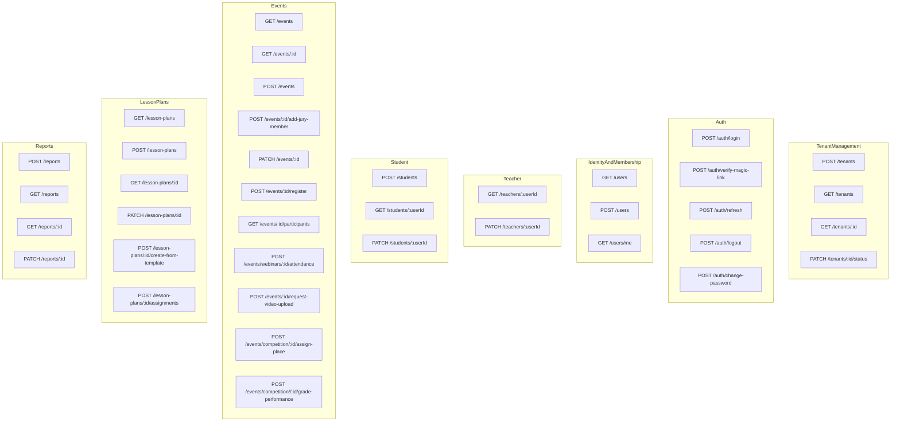
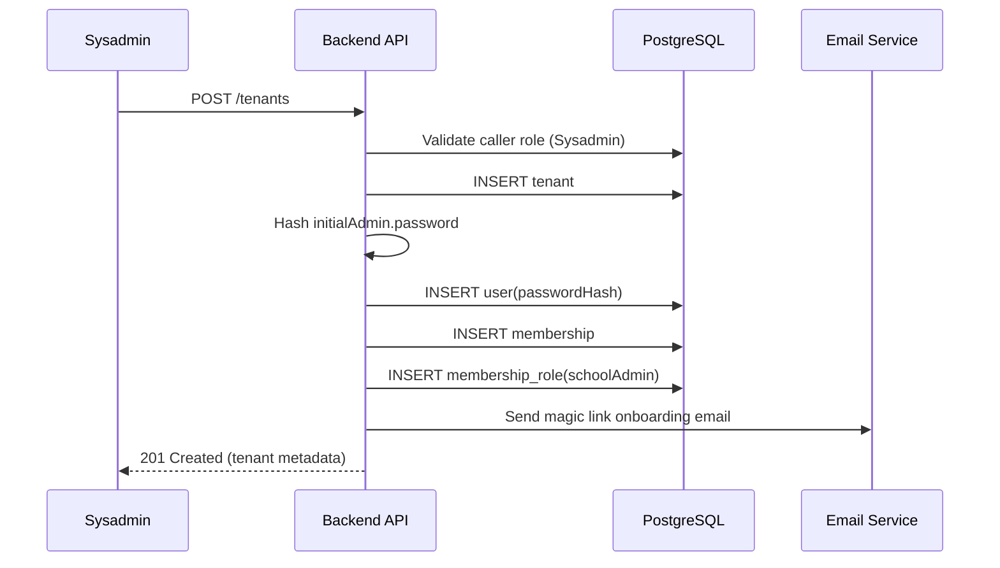
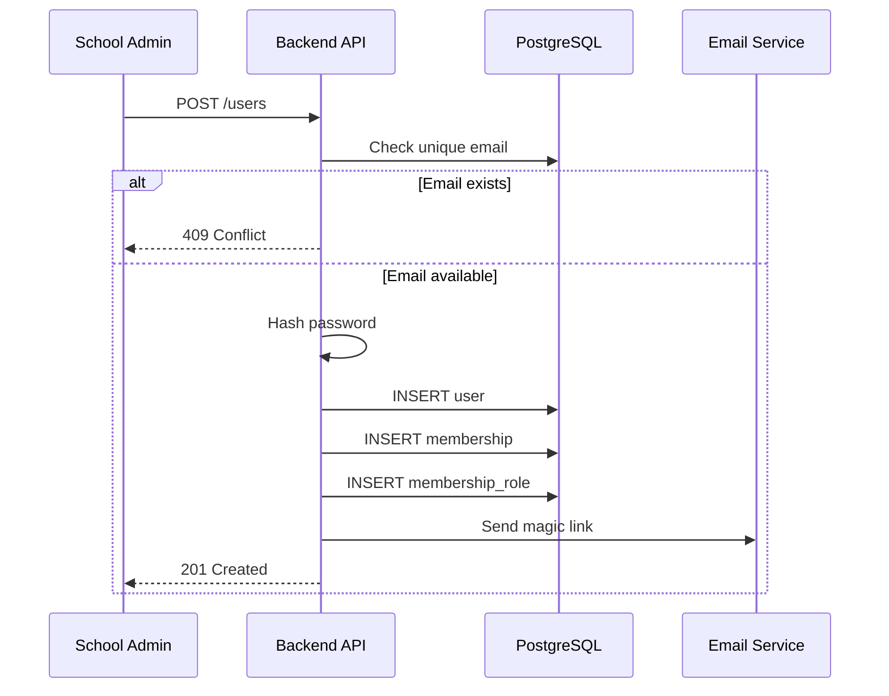
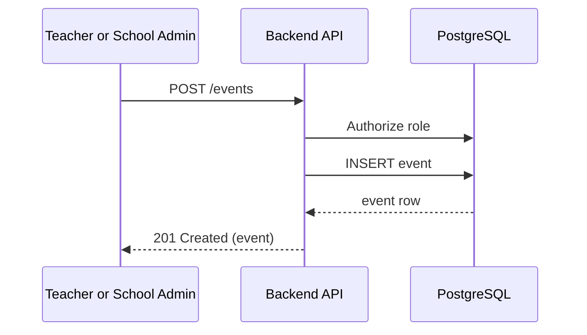
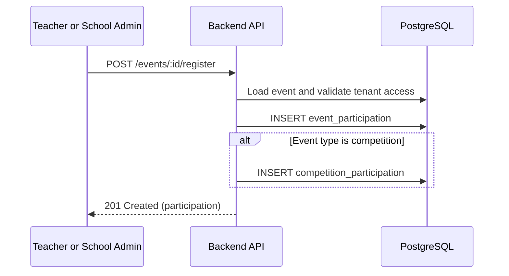
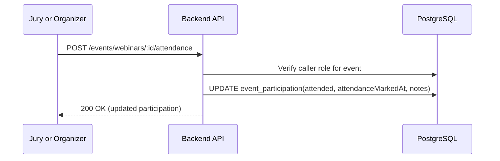
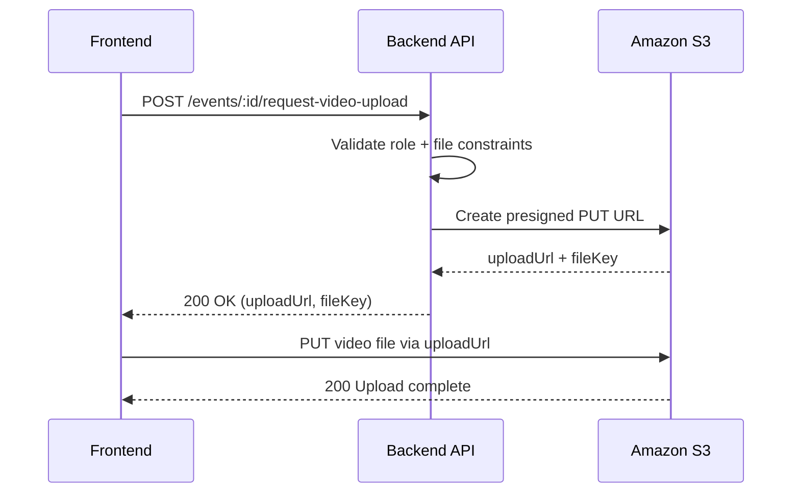
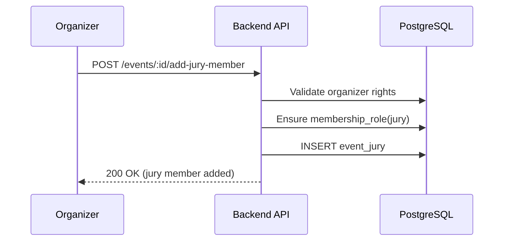
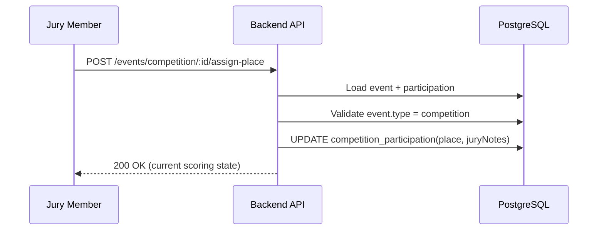
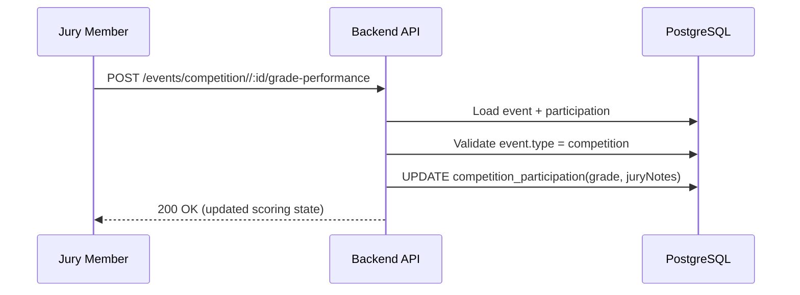

<!-- DOCS_NAV_START -->

[Docs Home](README.md) | [API Design](api-design.md) | [Auth](auth.md) | [RBAC](rbac.md) | [Data Model](data-model.md) | [Security](security.md) | [Deployment](deployment.md) | [Containers](containers.md) | [Context](context.md) | [Frontend](front.md) | [NFR](nfr.md) | [Req-Res Propagation](req-res-propagation.md) | [Risks](risks.md)

<!-- DOCS_NAV_END -->

## Навігація в документі

- [Перелік усіх ендпоїнтів](#перелік-усіх-ендпоїнтів)
  - [Керування тенантами](#керування-тенантами)
  - [Автентифікація](#автентифікація)
  - [Ідентичність і membership](#ідентичність-і-membership)
  - [Teacher](#teacher)
    - [Student](#student)
  - [Події](#події)
  - [Плани уроків](#плани-уроків)
  - [Звіти](#звіти)
- [Глобальна схема ендпоїнтів](#глобальна-схема-ендпоїнтів)
- [9 ДЕТАЛЬНИХ ОПИСІВ ЕНДПОЇНТІВ](#9-детальних-описів-ендпоїнтів)
- [КЕРУВАННЯ ТЕНАНТАМИ](#керування-тенантами)
  - [1. POST /tenants](#1-post-tenants)
- [ІДЕНТИЧНІСТЬ](#ідентичність)
  - [2. POST /users](#2-post-users)
- [ПОДІЇ](#події)
  - [3. POST /events](#3-post-events)
  - [4. POST /events/:id/register](#4-post-eventsidregister)
  - [5. POST /events/webinars/:id/attendance](#5-post-eventswebinarsidattendance)
  - [6. POST /events/:id/request-video-upload](#6-post-eventsidrequest-video-upload)
  - [7. POST /events/:id/add-jury-member](#7-post-eventsidadd-jury-member)
  - [8. POST /events/competition/:id/assign-place](#8-post-eventscompetitionidassign-place)
  - [9. POST /events/competition//:id/grade-performance](#9-post-eventscompetitionidgrade-performance)

<!-- DOCS_TOC_START -->
<!-- DOCS_TOC_END -->

## Перелік усіх ендпоїнтів

### Керування тенантами

- `POST /tenants` - sysadmin створює tenant + school admin за один крок
- `GET /tenants`
- `GET /tenants/:id`
- `PATCH /tenants/:id/status`

### Автентифікація

- `POST /auth/login` - валідація пароля + запит magic link
- `POST /auth/verify-magic-link` - реальний логін
- `POST /auth/refresh`
- `POST /auth/logout`
- `POST /auth/change-password`

### Ідентичність і membership

- `GET /users`
- `POST /users` - school admin створює користувача (teacher або student), membership і membershipRole за один крок
- `GET /users/me`

### Teacher

- `GET /teachers/:userId`
- `PATCH /teachers/:userId`

#### Student

- `POST /students` - teacher створює студента, і вони автоматично прив'язуються в teacher_student_assignment
- `GET /students/:userId`
- `PATCH /students/:userId`

### Події

- `GET /events`
- `GET /events/:id`
- `POST /events`
- `POST /events/:id/add-jury-member`
- `PATCH /events/:id`
- `POST /events/:id/register`
- `GET /events/:id/participants`
- `POST /events/webinars/:id/attendance` - відмітити відвідування (викликається для вебінарів)
- `POST /events/:id/request-video-upload` - це коли ми хочемо завантажити відео і просимо у сервера presignedUrl
- `POST /events/competition/:id/assign-place`
- `POST /events/competition//:id/grade-performance`

### Плани уроків

- `GET /lesson-plans`
- `POST /lesson-plans`
- `GET /lesson-plans/:id`
- `PATCH /lesson-plans/:id`
- `POST /lesson-plans/:id/create-from-template`
- `POST /lesson-plans/:id/assignments` - прив'язує план уроку до студента

### Звіти

- `POST /reports`
- `GET /reports`
- `GET /reports/:id`
- `PATCH /reports/:id`

## Глобальна схема ендпоїнтів



## 9 ДЕТАЛЬНИХ ОПИСІВ ЕНДПОЇНТІВ

## КЕРУВАННЯ ТЕНАНТАМИ

Правила доступу:

- Обов'язкова автентифікація
- Роль `SYSADMIN`

### 1. POST /tenants

Створює новий tenant (школу).

```json
{
  "name": "Kyiv Music School #7",
  "initialAdmin": {
    "fullName": "Olena Bondarenko",
    "email": "admin@school7.edu.ua",
    "password": "StrongPass!123"
  }
}
```

Відповідь `201`:

```json
{
  "id": "9c926e8a-2e4e-4490-98a0-725d32ba1628",
  "name": "Kyiv Music School #7",
  "status": "active",
  "createdAt": "2026-04-14T08:10:00Z"
}
```

Внутрішній потік:

1. Автентифікація та авторизація.
2. Створюється рядок у `tenant` (`status=active`).
3. `initialAdmin.password` хешується за допомогою алгоритму хешування паролів `bcrypt`.
4. Створюється рядок `user` з `initialAdmin.fullName` + `initialAdmin.email`, зберігається `passwordHash`.
5. Створюється рядок `membership`, що пов'язує нового admin-користувача з новим tenant.
6. Створюється `membership_role` із роллю `schoolAdmin`.
7. Ініціюється onboarding email з magic link для `initialAdmin.email`.
8. Повертаються дані.
9. Користувач натискає magic link в email і переходить на свою сторінку.
10. Вони можуть одразу змінити свій пароль.

Діаграма послідовності:



## ІДЕНТИЧНІСТЬ

### 2. POST /users

Створює teacher або student.

Автентифікація та ролі:

- Обов'язкова автентифікація: так
- Роль `SCHOOL ADMIN`

```json
{
  "fullName": "Maksym Kovalenko",
  "email": "maksym.kovalenko@school-a.edu.ua",
  "globalRole": "Member",
  "membershipRole": "Teacher",
  "password": "Secret2000"
}
```

Відповідь `201`:

```json
{
  "id": "f8f2aef3-8c1d-453f-ab2a-fda1faa8e072",
  "fullName": "Maksym Kovalenko",
  "email": "maksym.kovalenko@school-a.edu.ua",
  "globalRole": "Member",
  "membershipRole": "Teacher",
  "isActive": "true"
}
```

1. Перевіряється унікальність email: якщо email існує, повертається "Conflict".
2. Зберігається хеш пароля.
3. Створюються user + membership + membership role.
4. Новому користувачу надсилається magic link.
5. Новий користувач натискає magic link. Тепер він може бачити свій профіль і змінити пароль.

Діаграма послідовності:



## ПОДІЇ

### 3. POST /events

Створює подію (`webinar`, `concert`, `competition`).

Автентифікація та ролі:

- Обов'язкова автентифікація
- Роль `Teacher`, `School admin`

```json
{
  "scope": "TENANT",
  "type": "webinar",
  "name": "Methodology Webinar",
  "topic": "Choir rehearsal techniques",
  "startDate": "2026-04-20T15:00:00Z",
  "endDate": "2026-04-20T16:30:00Z",
  "organizerUserId": "9bdf0506-cb0f-4f54-860e-a6eb4f742fc2"
}
```

Відповідь `201`:

```json
{
  "id": "11c96f9b-0d8d-45f2-a26d-5f8e14666ec2",
  "scope": "TENANT",
  "schoolId": "9c926e8a-2e4e-4490-98a0-725d32ba1628",
  "type": "webinar",
  "name": "Methodology Webinar",
  "topic": "Choir rehearsal techniques",
  "videoUrl": null,
  "organizerUserId": "9bdf0506-cb0f-4f54-860e-a6eb4f742fc2",
  "startDate": "2026-04-20T15:00:00Z",
  "endDate": "2026-04-20T16:30:00Z"
}
```

Внутрішній потік:

1. Вставляється рядок у `event` з ID організатора та іншими вхідними даними.
2. Повертається створена подія.

Діаграма послідовності:



### 4. POST /events/:id/register

Реєструє учасника на подію.

Автентифікація та ролі:

- Обов'язкова автентифікація
- Роль `Teacher`

Тіло запиту:

```json
{
  "eventId": "4f2d6ce7-8d42-4d7e-8f4a-4e953d3f66b5",
  "participantUserId": "7777d9fb-8c37-4b12-b0b3-09f66dc34f7f",
  "roleInEvent": "performer",
  "notes": "solo piano"
}
```

Відповідь `201`:

```json
{
  "id": "b76607e7-e5b1-49bc-8130-836b3d5d1ed7",
  "eventId": "4f2d6ce7-8d42-4d7e-8f4a-4e953d3f66b5",
  "participantUserId": "7777d9fb-8c37-4b12-b0b3-09f66dc34f7f",
  "schoolId": "9c926e8a-2e4e-4490-98a0-725d32ba1628",
  "roleInEvent": "performer",
  "attended": false,
  "notes": "solo piano"
}
```

Внутрішній потік:

1. Авторизація + додатковий чек на user.schoolId === event.schoolId (у спеціальній мідлварі, див. rbac.md), якщо подія має tenant-скоуп. Інакше продовжується без цієї перевірки.
2. Вставка у `event_participation`.
3. Якщо це конкурс, вставка у `competition_participation` з null grade/place.
4. Повертаються дані участі.

Діаграма послідовності:



### 5. POST /events/webinars/:id/attendance

Автентифікація та ролі:

- Обов'язкова автентифікація
- Роль `Organizer`

```json
{
  "participantUserId": "7777d9fb-8c37-4b12-b0b3-09f66dc34f7f",
  "attended": true,
  "notes": "arrived on time"
}
```

Внутрішній потік:

1. Авторизувати користувача.
2. Оновити `attended`, `attendanceMarkedAt`, `notes`.
3. Повернути оновлену участь.

Діаграма послідовності:



### 6. POST /events/:id/request-video-upload

Крок 1: запит одноразового presigned URL для завантаження відео події.

Автентифікація та ролі:

- Обов'язкова автентифікація
- Роль `Participant`, `Organizer`

Тіло запиту:

```json
{
  "eventId": "11c96f9b-0d8d-45f2-a26d-5f8e14666ec2",
  "fileName": "webinar-2026-04-20.mp4",
  "contentType": "video/mp4",
  "fileSizeBytes": 523001002,
  "participantId": "dkejn46218ttt"
}
```

Відповідь `200`:

```json
{
  "eventId": "11c96f9b-0d8d-45f2-a26d-5f8e14666ec2",
  "uploadUrl": "https://s3.eu-west-1.amazonaws.com/...signed...",
  "fileKey": "events/11c96f9b-0d8d-45f2-a26d-5f8e14666ec2/webinar-2026-04-20.mp4",
  "expiresInSeconds": 900
}
```

Внутрішній потік:

1. Авторизація
2. Перевірити обмеження файлу (тип, розмір)
3. Отримати метадані події (наприклад, тип)
4. Згенерувати структурований fileKey на основі ключової інформації (тип події, participantId, organizerId тощо)
5. Бекенд створює presigned PUT URL для Amazon S3
6. Повернути uploadUrl і fileKey клієнту
7. Клієнт завантажує файл напряму в S3

Діаграма послідовності:



### 7. POST /events/:id/add-jury-member

Додає члена журі до події.

Автентифікація та ролі:

- Обов'язкова автентифікація
- Роль `Organizer`

Тіло запиту:

```json
{
  "juryUserId": "3c89e6e0-1886-4ff7-88fd-bc45d0e1a0da",
  "role": "jury"
}
```

Відповідь `200`:

```json
{
  "eventId": "11c96f9b-0d8d-45f2-a26d-5f8e14666ec2",
  "juryUserId": "3c89e6e0-1886-4ff7-88fd-bc45d0e1a0da",
  "membershipRole": "jury",
  "addedAt": "2026-04-20T17:00:00Z"
}
```

Внутрішній потік:

1. Авторизація.
2. Додавання запису в `event_jury`.
3. Повернення інформації про доданого члена журі.

Діаграма послідовності:



### 8. POST /events/competition/:id/assign-place

Призначає місце учаснику.

Автентифікація та ролі:

- Обов'язкова автентифікація
- Роль `JURY` + додатков аперевірка `isCurrentEventJury`

```json
{
  "eventId": "4f2d6ce7-8d42-4d7e-8f4a-4e953d3f66b5",
  "participantUserId": "7777d9fb-8c37-4b12-b0b3-09f66dc34f7f",
  "place": 1,
  "juryNotes": "Excellent interpretation and technique"
}
```

Відповідь `200`:

```json
{
  "participationId": "b76607e7-e5b1-49bc-8130-836b3d5d1ed7",
  "grade": 96.5,
  "place": 1,
  "juryNotes": "Excellent interpretation and technique"
}
```

Внутрішній потік:

1. Знайти подію + участь за `(eventId, participantUserId)`.
2. Перевірити, що тип події - competition.
3. Оновити `competition_participation.place` і `juryNotes`.
4. Повернути поточний стан оцінювання.

Діаграма послідовності:



### 9. POST /events/competition//:id/grade-performance

Виставляє оцінку за виступ учасника конкурсу.

Автентифікація та ролі:

- Обов'язкова автентифікація
- Роль `JURY` + додатков аперевірка `isCurrentEventJury`

Тіло запиту:

```json
{
  "participantUserId": "7777d9fb-8c37-4b12-b0b3-09f66dc34f7f",
  "grade": 96.5,
  "juryNotes": "Excellent interpretation and technique"
}
```

Відповідь `200`:

```json
{
  "participationId": "b76607e7-e5b1-49bc-8130-836b3d5d1ed7",
  "grade": 96.5,
  "juryNotes": "Excellent interpretation and technique",
  "updatedAt": "2026-04-20T17:30:00Z"
}
```

Внутрішній потік:

1. Знайти подію і участь за `:id` та `participantUserId`.
2. Перевірити, що подія є конкурсом і викликач має роль журі.
3. Оновити `competition_participation.grade` і `juryNotes`.
4. Повернути оновлений стан оцінювання.

Діаграма послідовності:



```

```
